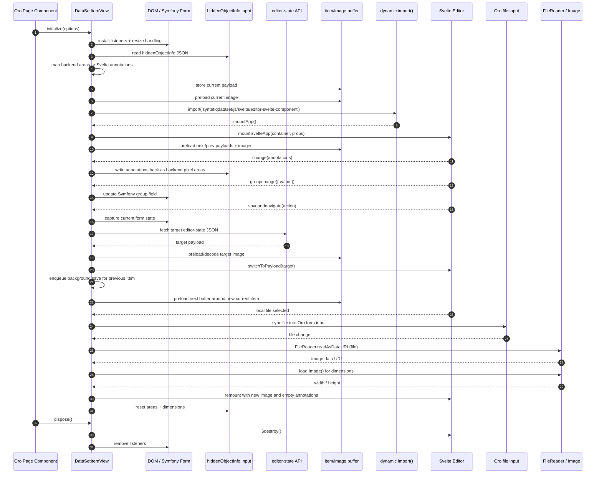

# `dataset-item-view.js`

Documentation for [dataset-item-view.js](./Resources/public/js/app/views/dataset-item-view.js) and the Svelte image editor it mounts.

## Responsibility Split

### Svelte component responsibility

The Svelte editor bundle is a UI layer only.

Its responsibilities are:

- render the image annotation workspace
- render and edit annotations in percentage-based coordinates
- render group buttons and emit `groupchange`
- render next and previous buttons and emit `saveandnavigate`
- render the image upload button and local file picker
- render sidebar controls for annotation titles and selection
- keep editor-local interaction state such as zoom, pan, active annotation, drawing, resizing, and hover state
- optionally trigger host-provided AI assist callbacks without knowing backend details
- report annotation changes back to the container through DOM events

The Svelte editor should not know:

- how Symfony/Oro form fields are named
- how data is persisted to the backend
- how next/previous item state is fetched
- how buffered navigation and background save queues work
- how datagrid filters and sorting affect navigation

In short: Svelte owns the editor UI and emits user intent.

### `dataset-item-view.js` responsibility

`DataSetItemView` is the integration and orchestration layer between Oro/Symfony and the Svelte editor.

Its responsibilities are:

- read initial editor state from the DOM and page component options
- translate backend `hiddenObjectInfo` into Svelte annotations
- translate edited annotations back into backend pixel coordinates
- keep Symfony form inputs in sync with what the user does in Svelte
- mirror the Svelte file picker into Oro's real file input
- mount, remount, and dispose the Svelte app
- resolve `returnUrl` and next/previous navigation actions
- fetch editor-state JSON for nearby items
- preload nearby images and keep a bounded in-memory buffer
- switch to buffered items immediately on next/previous
- proxy click-to-segment requests from the Svelte editor to the backend API
- queue background saves for previously edited items
- flush failed/pending saves before full form submit or page unload
- fall back to normal form-submit navigation if buffered navigation fails

In short: `dataset-item-view.js` owns data flow, buffering, persistence bridging, and navigation orchestration.

## Main Flow

## Data Bridges

### `hiddenObjectInfo`

`hiddenObjectInfo` is the main persistence bridge.

- backend stores annotation areas in pixels
- Svelte edits annotations in percentages
- `dataset-item-view.js` converts between the two

### Group field

The Svelte editor does not submit the Symfony group field directly.

- Svelte emits `groupchange`
- `dataset-item-view.js` updates the real Symfony field
- the updated form state is what gets saved in background or on normal submit

### File upload

The Svelte file input is only a UI convenience.

- the real uploaded file must live in Oro's form input
- `dataset-item-view.js` mirrors the selected file into that input

## Buffered Navigation Notes

- Buffer size is controlled by `preloadRadius`
- Buffering is local to nearby items only; it does not preload the entire dataset
- Images are preloaded and decoded before navigation when possible
- After navigation, the previous item is saved in the background
- If buffered loading fails, the view falls back to standard form-submit navigation

## Rule of Thumb

- Put editor interaction and visual behavior into the Svelte component
- Put Symfony/Oro integration, persistence, buffering, and navigation logic into `dataset-item-view.js`
