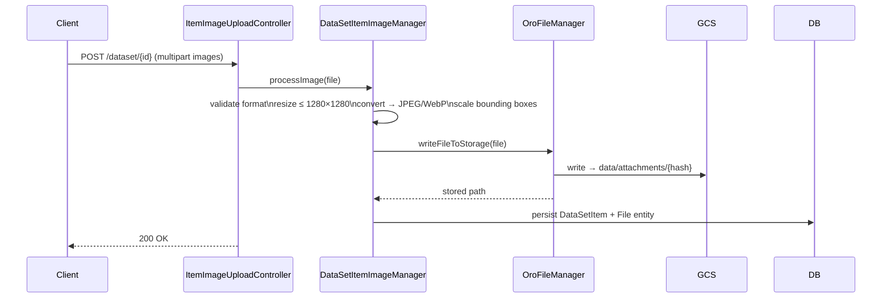
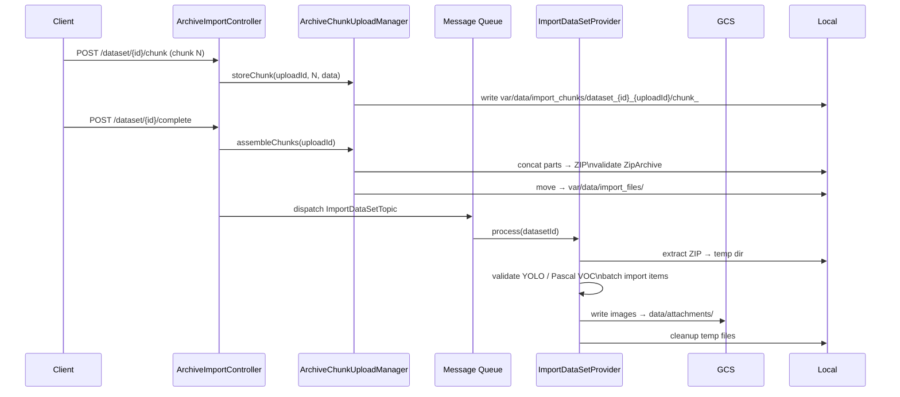
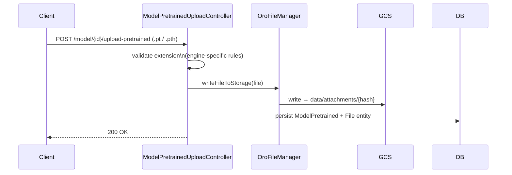
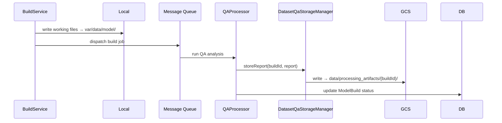
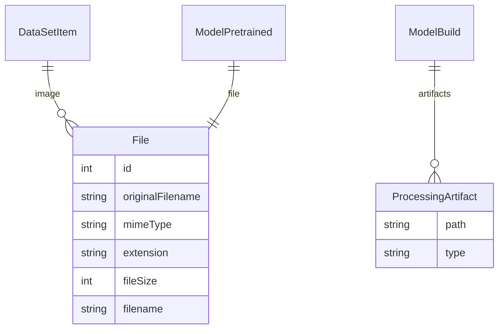

# File Storage Architecture

## Overview

SyntetiQ uses a two-tier file storage strategy:

- **Google Cloud Storage (GCS)** — persistent storage for all production data (attachments, artifacts, QA reports)
- **Local Filesystem** — temporary/staging storage for in-flight operations (uploads, imports, model builds)

The abstraction layer is **Gaufrette** (Oro Platform's standard), backed by **Flysystem** adapters via a custom bridge.

---

## Storage Backends

| Backend | Purpose | When Used |
|---------|---------|-----------|
| Google Cloud Storage | Persistent file storage | Production attachments, processed data, QA reports |
| Local Filesystem (`var/data/`) | Staging & temp | Chunked uploads, imports, model builds |

### GCS Configuration

| Environment Variable | Description |
|---------------------|-------------|
| `GCS_PROJECT_ID` | GCP project identifier |
| `GCS_KEY_FILE_LOCATION` | Path to service account JSON key |
| `GCS_BUCKET_NAME` | Target GCS bucket |
| `STORAGE_EMULATOR_HOST` | Fake GCS host for local dev (e.g. `fake-gcs-server`) |

Base directory inside the bucket: `data/`

---

## Filesystem Registry

All filesystems are defined in:
- [app/src/SyntetiQ/Bundle/ModelBundle/Resources/config/filesystems.yml](app/src/SyntetiQ/Bundle/ModelBundle/Resources/config/filesystems.yml) — service definitions
- [app/config/config.yml](app/config/config.yml) (lines 171–243) — Gaufrette/Flysystem wiring

### GCS-backed Filesystems

| Filesystem Name | GCS Path | Content |
|----------------|---------|---------|
| `attachments` | `data/attachments/` | Images, pretrained model files, all Oro `File` entities |
| `attachments_cleanup_data` | `data/attachments_cleanup_data/` | Orphan-file tracking metadata |
| `import_tmp` | `data/import_tmp/` | Temporary files during async import processing |
| `processing_artifacts` | `data/processing_artifacts/` | Model build outputs, training logs |
| `qa_reports` | `data/processing_artifacts/` | QA analysis reports (alias for `processing_artifacts`) |

### Local-backed Filesystems

| Filesystem Name | Local Path | Content |
|----------------|-----------|---------|
| `import_files` | `var/data/import_files/` | Assembled ZIPs awaiting processing |
| `import_chunks` | `var/data/import_chunks/` | Raw upload chunks before assembly |
| `import_export` | `var/data/import_export/` | Oro import/export working directory |
| `model_files` | `var/data/model/` | Model build working files |

---

## Abstraction Layer

```
Controller / Service
        │
        ▼
Oro FileManager  (sq.file_manager.*)
        │
        ▼
Gaufrette Filesystem
        │
        ▼
SyntetiQ FlysystemAdapter          ← custom bridge
        │
        ▼
Flysystem GoogleCloudStorageAdapter  OR  LocalFilesystemAdapter
        │
        ▼
GCS Bucket  /  var/data/
```

Key files:

| File | Role |
|------|------|
| [FlysystemAdapter.php](app/src/SyntetiQ/Bundle/ModelBundle/Gaufrette/Adapter/FlysystemAdapter.php) | Gaufrette → Flysystem bridge |
| [GoogleCloudStorageClientFactory.php](app/src/SyntetiQ/Bundle/ModelBundle/Factory/GoogleCloudStorageClientFactory.php) | Builds GCS client (supports emulator) |

---

## Data Flows

### 1. Dataset Image Upload



### 2. Chunked Archive Upload (Dataset ZIP)



### 3. Pretrained Model Upload



### 4. Model Build & QA Artifacts



---

## File Entity Lifecycle

Every file stored via Oro AttachmentBundle creates two records:

1. **Database** (`oro_attachment_file`): original filename, MIME type, extension, size, storage path
2. **GCS object**: actual binary content at `data/attachments/{storage_filename}`



---

## Local Temporary Paths

```
app/
└── var/
    └── data/
        ├── import_chunks/          # raw upload chunks
        │   └── dataset_{id}_{uploadId}/
        │       └── chunk_######.part
        ├── import_files/           # assembled ZIPs ready for processing
        ├── import_export/          # Oro import/export working area
        └── model/                  # model build working files
```

---

## GCS Bucket Layout

```
{GCS_BUCKET_NAME}/
└── data/
    ├── attachments/                # all Oro File entities (images, models)
    ├── attachments_cleanup_data/   # orphan-tracking metadata
    ├── import_tmp/                 # temp files during async import
    └── processing_artifacts/       # model build artifacts & QA reports
        └── {buildId}/
            └── report.json
```

---

## Orphan File Cleanup

The `CleanupGcsAttachmentFilesCommand` periodically:

1. Lists all objects in `data/attachments/`
2. Compares against `oro_attachment_file` rows still referenced by active entities
3. Deletes unreferenced GCS objects
4. Logs deletions to `data/attachments_cleanup_data/`

---

## Local Development

To run without real GCS credentials, set `STORAGE_EMULATOR_HOST` to a [fake-gcs-server](https://github.com/fsouza/fake-gcs-server) instance. `GoogleCloudStorageClientFactory` detects this variable and configures the client to use the emulator endpoint instead of `storage.googleapis.com`.
